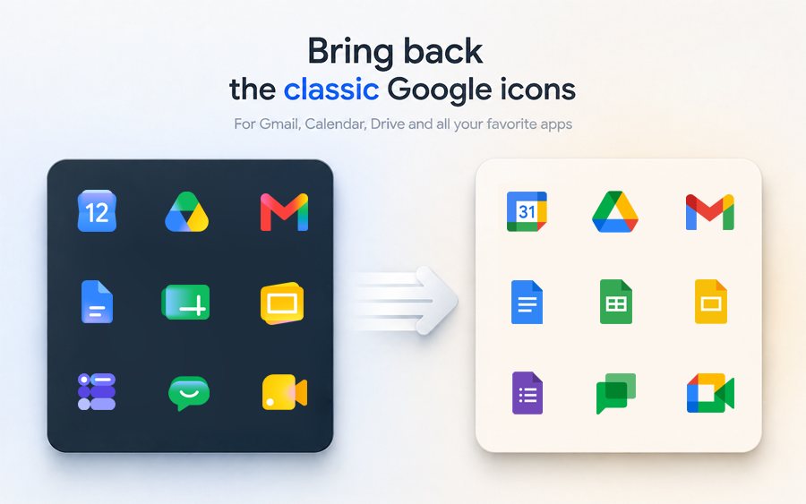

# Classic Google Workspace Icons



A cross-browser extension for restoring older, flatter, and more distinguishable Google Workspace icons instead of the new gradient redesign.

| Browser | Version | Download |
| :--- | :--- | :--- |
| **Firefox** | [](https://addons.mozilla.org/addon/classic-google-workspace-icons/) | [](https://addons.mozilla.org/addon/classic-google-workspace-icons/) |

## Features

This extension replaces the new gradient Google Workspace logos and assets with their classic, flatter, and more recognizable counterparts.

- **Selective App Replacement**: Toggle icon restoration individually for Gmail, Calendar, Drive, Docs, Sheets, Slides, Forms, Vids, Meet, Chat, Keep, Tasks, and Maps directly in the extension popup.
- **Local & Lightweight**: No runtime external dependencies. All assets (icons and CSS rules) are bundled within the extension for instant loading.
- **Privacy Focused**: No tracking, telemetry, or external network requests.
- **Reliable Replacements**: Restores classic logos using CSS overrides, DOM updates, and managed content-script registration while keeping adjacent page flows intact.

## Manifest Layout

Source manifests live in `manifests/`:

- `manifests/base.json` - shared manifest fields
- `manifests/firefox.json` - Firefox-only overlay
- `manifests/chrome.json` - Chrome-only overlay
- Final manifests are generated into `dist/<target>-package/manifest.json` during packaging.

## Build And Packaging

There are now two different build flows, because they solve different tasks:

- `stage` prepares an unpacked extension directory in `dist/<target>-package/` for manual loading in the browser.
- `package` builds the final distributable archive (`.xpi` or `.zip`) and uses a production stage internally.

`package` was not removed. `stage` was added because browser loading and final packaging are not the same workflow.

Fast path for local validation and packaging:

```bash
npm run build
```

Prepare unpacked staged builds for manual loading:

```bash
npm run stage:firefox:dev
npm run stage:firefox:prod
npm run stage:chrome:dev
npm run stage:chrome:prod
```

Mode differences:

- `dev` keeps debug logging and logo probing enabled.
- `prod` disables debug-only runtime logging and uses production build flags.

The low-level manifest script still exists, but it only writes `manifest.json` and does not prepare the full staged extension by itself:

```bash
node scripts/build-manifest.js firefox dist/firefox-package
node scripts/build-manifest.js chrome dist/chrome-package
```

Build packaged extension artifacts:

```bash
npm run package:firefox
npm run package:chrome
```

Packaging always uses the production mode internally.

Canonical reviewer-friendly Firefox rebuild path:

```bash
npm ci --ignore-scripts
npm run package:firefox
```

PowerShell scripts remain available only as optional Windows compatibility wrappers.
The repository pins dependency versions in `package-lock.json` and blocks install scripts via `.npmrc`.

Output artifacts:

- Firefox package: `dist/classic-google-workspace-icons-<version>-firefox.xpi`
- Chrome package: `dist/classic-google-workspace-icons-<version>-chrome.zip`

Staging directories:

- Firefox staged extension: `dist/firefox-package/`
- Chrome staged extension: `dist/chrome-package/`

## Local Testing

Run tests:

```bash
npm test
```

The direct Node command still works too:

```bash
node --test tests/*.test.js
```

## CI And Release Tags

- Regular `push` and `pull_request` runs execute tests only.
- Packaged release artifacts are built only on version tag pushes.
- Supported release tag formats: `v0.1.0` or `0.1.0`.
- The pushed tag must match `manifests/base.json` -> `version`.

Load temporary Firefox build:

1. Run `npm run stage:firefox:dev`
2. Open `about:debugging#/runtime/this-firefox`
3. Choose `Load Temporary Add-on`
4. Select `dist/firefox-package/manifest.json`

If you want to verify the production runtime behavior before store upload, use `npm run stage:firefox:prod` or `npm run stage:chrome:prod` and load that staged directory manually.

For store submission, upload packaged files from `dist/`.

## Runtime Notes

- Favicon and app icon surface replacements are regular manifest content scripts.
- Header/logo replacements are settings-aware dynamic registrations managed from background code.
- After changing extension settings or reloading the extension, header/logo changes apply on subsequent navigations and page reloads.
- Already-open pages may need a manual reload to pick up header/logo changes. This is expected with the current architecture.
