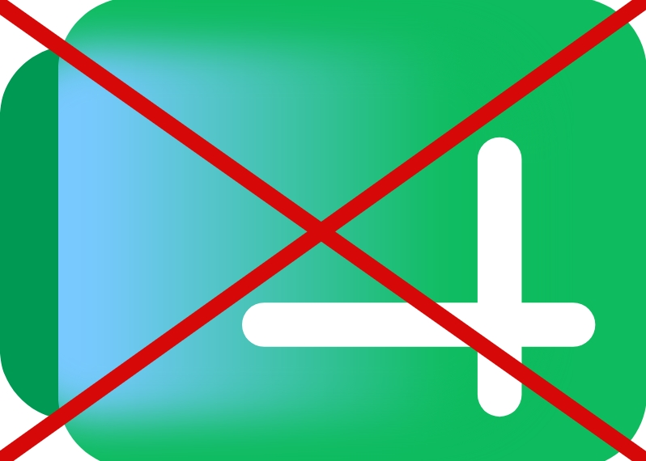

# Make Google Flat Again

A cross-browser extension for restoring older, flatter, and more distinguishable Google Workspace icons instead of the new gradient redesign.



## Idea

This project is not a full "theme for all of Google". It is a targeted replacement of visual elements:

- older app icons
- specific sprites and SVG assets
- CSS rules responsible for the new icons

The base approach is local overrides through WebExtension content scripts and background-managed registrations, without a heavy build setup or unnecessary dependencies.

## Goals

- Firefox-first, with separate Chrome packaging
- zero-dependency base
- local assets and local logic
- clear structure with target-specific packaging
- the ability to fix icons app by app: Drive, Docs, Sheets, Gmail, and so on

## Plan

1. Build a list of Google Workspace surfaces that are actually worth fixing.
2. Document the selectors, sprites, SVGs, and URLs involved in rendering the new icons.
3. Replace them with older versions through local CSS/SVG overrides.
4. Verify that this does not break adjacent flows or different `docs.google.com` products.
5. Package it as Firefox and Chrome artifacts suitable for manual installation and store upload.

## Principles

- minimal changes
- a single source of truth for target matching

## Manifest Layout

Source manifests live in `manifests/`:

- `manifests/base.json` - shared manifest fields
- `manifests/firefox.json` - Firefox-only overlay
- `manifests/chrome.json` - Chrome-only overlay
- Final manifests are generated into `dist/<target>-package/manifest.json` during packaging.

## Build And Packaging

Build a target manifest into a staging directory:

```powershell
node scripts/build-manifest.js firefox dist/firefox-package
node scripts/build-manifest.js chrome dist/chrome-package
```

Build packaged extension artifacts:

```powershell
powershell -File scripts/package-firefox.ps1
powershell -File scripts/package-chrome.ps1
```

Output artifacts:

- Firefox package: `dist/make-google-flat-again-<version>-firefox.xpi`
- Chrome package: `dist/make-google-flat-again-<version>-chrome.zip`

Staging directories:

- Firefox staged extension: `dist/firefox-package/`
- Chrome staged extension: `dist/chrome-package/`

## Local Testing

Run tests:

```powershell
node --test tests/*.test.js
```

Load temporary Firefox build:

1. Run `powershell -File scripts/package-firefox.ps1`
2. Open `about:debugging#/runtime/this-firefox`
3. Choose `Load Temporary Add-on`
4. Select `dist/firefox-package/manifest.json`

For store submission, upload packaged files from `dist/`.

## Runtime Notes

- Favicon and sidepanel replacements are regular manifest content scripts.
- Header/logo replacements are settings-aware dynamic registrations managed from background code.
- After changing extension settings or reloading the extension, header/logo changes are guaranteed for new navigations and page reloads.
- Already-open pages may need a manual reload to pick up header/logo changes. This is expected with the current architecture.
